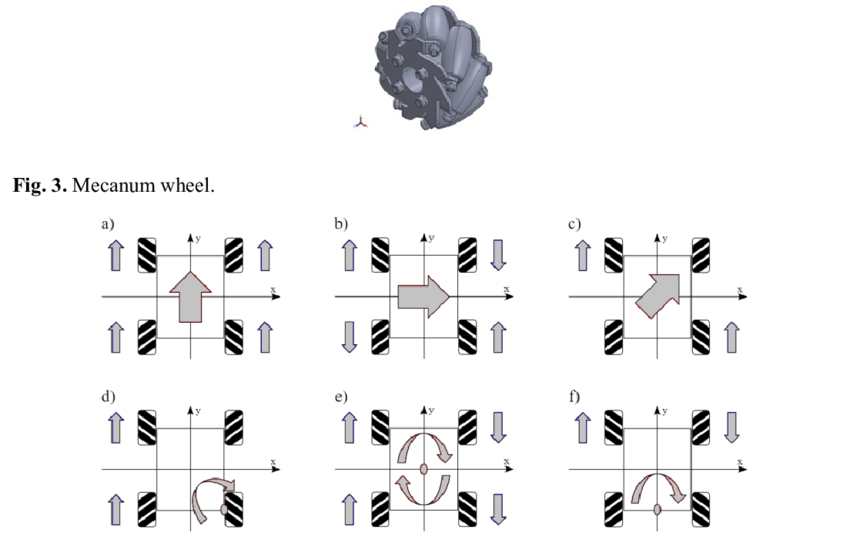

# Arduino Uno Code for 4-Wheel Mecanum Drive

This repository contains Arduino Uno code for controlling a 4-wheel differential mecanum drive. The motors used are inexpensive "TT motors," each with two wires: one for voltage input and one for output. An L298N motor driver is used to control the left-side and right-side motors.

# Features

* Omnidirectional Movement: The mecanum wheel design allows for precise movement in all directions by controlling the speed and direction of individual motors.

* Customizable Pin Configuration: Pin connections are stored in the Motor class and initialized using the MotorCommand class. You can set up your pins however you prefer, but ensure that the speed pin is connected to one of the PWM pins on the Arduino.

#Pin Configuration 

Ensure that:

* The left-side motors are connected to one channel of the L298N motor driver.
* The right-side motors are connected to the other channel of the L298N motor driver.
* Speed pins are attached to PWM pins on the Arduino for proper speed control.

The four wheel mecanum wheel can provide omnidirectional movement, by control each motors direction and speed.

#Command Interface

The robot accepts serial commands to control movement, which are mapped using the following enum class:

enum class RobotMovement: char{
    STOP = 'x',
    MOVE_FORWARD = 'w',
    MOVE_BACKWARD = 's',
    TURN_LEFT = 'l',
    TURN_RIGHT = 'r',
    TURN_LEFT_OPP = 'a',
    TURN_RIGHT_OPP = 'd',
    FASTER = '+',
    SLOWER = '-',
    INVALID = '?'
};

* STOP: Halts all motor activity.
* MOVE_FORWARD / MOVE_BACKWARD: Moves the robot forward or backward.
* TURN_LEFT / TURN_RIGHT: Rotates the robot in place to the left or right.
* TURN_LEFT_OPP / TURN_RIGHT_OPP: Performs lateral strafing motions to the left or right.
* FASTER / SLOWER: Adjusts the robot's speed incrementally.
* INVALID: Handles unrecognized commands.

Additional commands will be added in future updates.

# How it workds

1. Motor Initialization:
*  Motors are initialized via the Motor class, which handles pin configurations and operations.
2. Command Processing:
* Serial commands are read and translated into movements using the RobotMovement enum.
3. Omnidirectional Control:
* By adjusting motor speed and direction, the robot achieves full omnidirectional movement.

# Visual Representiation

# Future updates
Planned improvements:

* Adding more movement commands.
* Enhancing motor control algorithms for smoother performance.
* Support for additional motor driver configurations.

Feel free to explore, modify, and contribute to this project! If you encounter any issues or have suggestions for improvement, open an issue or submit a pull request.